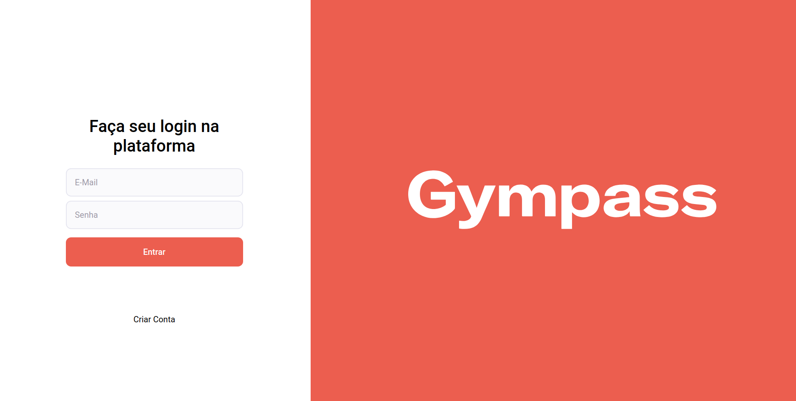
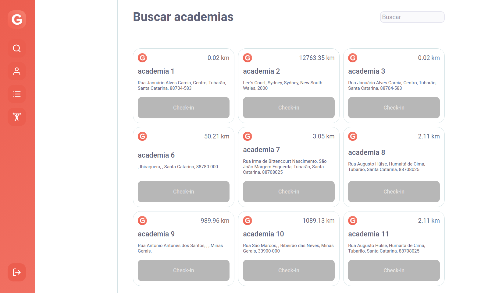
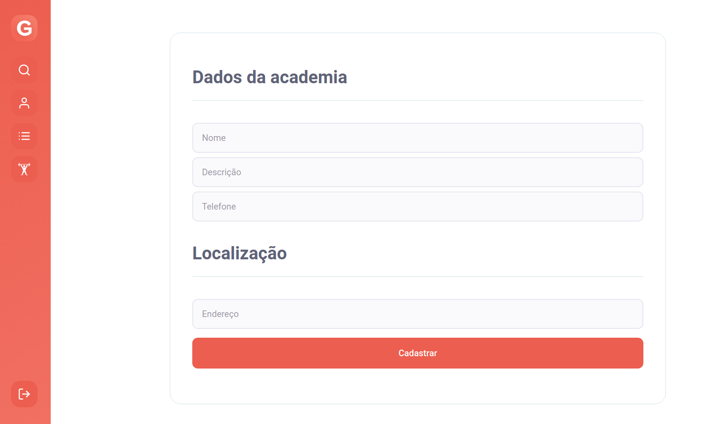
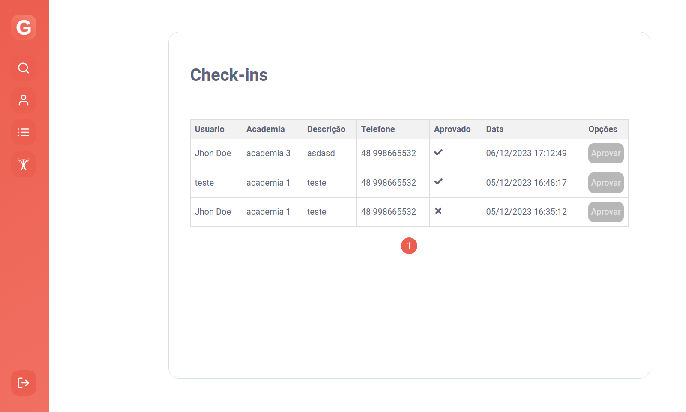

<h1 align="center">
    
</h1>

<h4 align="center">
	Gympass - Frontend
</h4>

<p align="center" style="display: flex; align-items: flex-start; justify-content: center;">
  

  

  

  
</p>


## 🛠 Tecnologias

As seguintes ferramentas foram usadas na construção do projeto:

- [Node.js](https://nodejs.org/en)
- [React](https://react.dev/)
- [TypeScript](https://www.typescriptlang.org/)
- [NextJs](https://nextjs.org/)


### Pré-requisitos

Antes de começar, você vai precisar ter instalado em sua máquina as seguintes ferramentas:
[Git](https://git-scm.com), [Node.js](https://nodejs.org/en). Além disto é bom ter um editor para trabalhar com o código como [VSCode](https://code.visualstudio.com/)


### 🧭 Rodando a aplicação web (Front End)

```bash
# Clone este repositório
$ git clone https://github.com/hericke47/innova.git

# Acesse a pasta do projeto no seu terminal/cmd
$ cd Innova

# Vá para a pasta da aplicação Front End
$ cd Frontend

# Instale as dependências
$ npm install

# Execute a aplicação em modo de desenvolvimento
$ npm start

# A aplicação será aberta na porta:3000 - acesse http://localhost:3000
```
